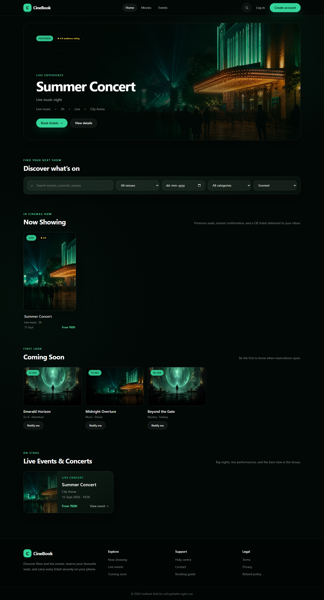
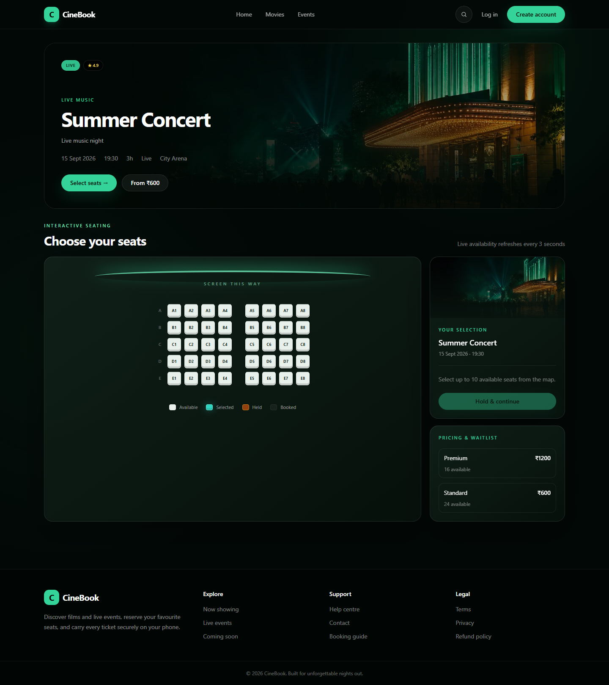
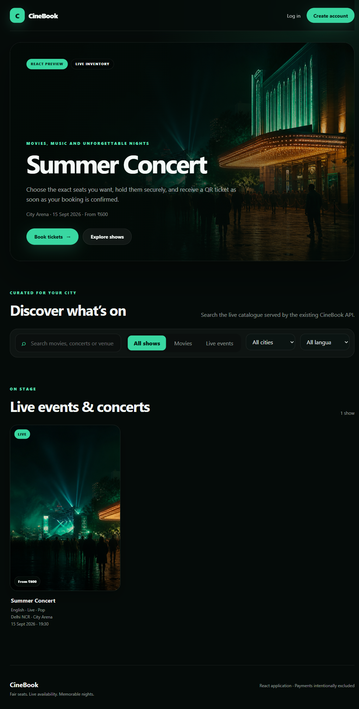
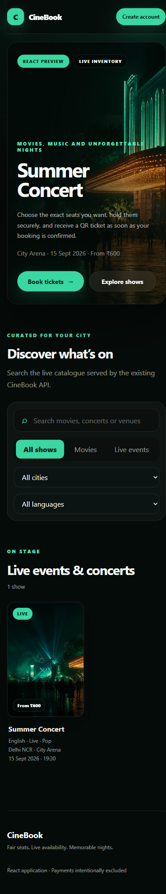
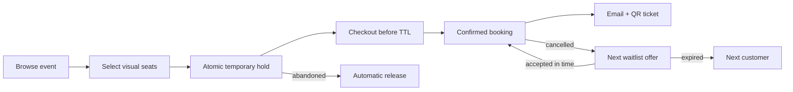
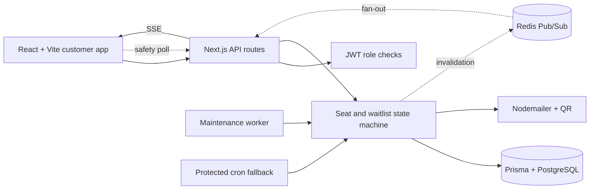

<div align="center">

# CineBook

### Fair, concurrency-safe ticket booking for movies and concerts


[](https://nextjs.org/)
[](https://www.typescriptlang.org/)
[](https://www.prisma.io/)
[](https://www.postgresql.org/)
[](https://redis.io/)
[](#testing)
[](https://github.com/Mayank2142/ticket-booking/tree/main)

Premium event discovery · visual seat selection · expiring holds · fair waitlist offers · QR email tickets

[Preview](#product-preview) · [Features](#features) · [Design](#how-the-hard-parts-work) · [Setup](#local-setup) · [API](#api-reference) · [Deploy](#railway-deployment)

</div>

---

## Product preview

| Discover events | Select seats in real time |
|---|---|
|  |  |

<p align="center"> </p>

The responsive interface follows one cinematic system from discovery to confirmation: deep-black and emerald surfaces, poster-led event cards, live seat states, a curved screen map, sticky checkout summaries, downloadable QR passes, graceful loading/error/empty states, and mobile-first navigation. The artwork in `public/images` is original project artwork generated for CineBook—no third-party film posters or logos are bundled.

## At a glance

| Evaluation area | Implementation | Evidence |
|---|---|---|
| Seat hold and TTL | Configurable transactional holds plus lazy and scheduled expiry | `src/lib/seats.ts`, cleanup route, integration test 2 |
| Concurrency protection | Conditional state transitions inside database transactions | Integration tests 1, 3 and 6 |
| Waitlist allocation | FIFO category queues, atomic offer claims and single-use tokens | Integration tests 3–6 |
| Time-limited offers | Dedicated offered seat, expiry timestamp, token validation and automatic cascade | Offer API and integration tests 4–5 |
| Real-time seat map | SSE invalidation with Redis cross-instance fan-out and polling recovery | `ShowSeat`, stream route, `SeatMap.tsx` |
| QR and email | Booking-reference QR attachment with durable SMTP retry tracking | `qrcode`, Nodemailer, delivery service |
| Role-based workflows | Customer, organiser and admin pages backed by JWT role checks | Protected pages and API routes |

### Booking lifecycle



## Why this project is different

Most booking demos stop at a seat grid. CineBook combines a polished booking journey with the failure-case handling that matters when demand is high:

- **Atomic seat transitions:** a conditional database update must affect exactly one row before a hold or booking succeeds.
- **Materialised show inventory:** every event owns a `ShowSeat` snapshot, so the same venue can safely host many shows.
- **Dual expiry:** abandoned holds and stale offers are released both lazily during seat-map reads and proactively by a dedicated worker.
- **Resilient live updates:** Redis fans out inventory invalidations across API instances; SSE refreshes browsers without making Redis the source of truth.
- **Fair cancellation recovery:** a cancelled seat is reserved for the first waiting customer in its category, with a single-use expiring token.
- **Offer bypass prevention:** a seat reserved by the waitlist cannot be held or booked without its matching token.
- **Atomic fulfillment:** booking the offered seat and changing `OFFERED → FULFILLED` happen in one transaction.
- **Resilient email delivery:** booking success never becomes booking failure because SMTP is unavailable; undelivered messages are tracked and retried.
- **Layout safety:** admins may fully create, edit, and delete flexible venue layouts, but layouts are locked once events depend on them.
- **Catalogue-aware discovery:** reusable content groups showtimes while city, auditorium, language, format, genre, duration, and certificate metadata power filters and comparisons.
- **Taste signals:** customer favourites and booking history drive explainable genre/language recommendations, with booking popularity as the public fallback.

## Features

| Role | Capabilities |
|---|---|
| Customer | Register/login, search and filter events, open rich event details, view live seats, hold/book seats, receive/download QR tickets, join category waitlists, view ticket history, cancel bookings |
| Organiser | Register/login, create movie or concert listings, choose venue/date/time, set per-category pricing, view aggregate bookings and revenue reports |
| Admin | Create arbitrary seat categories, assign category rows and colours, edit/delete unused venues, create events, inspect protected layouts |

Platform capabilities:

- Configurable hold and waitlist-offer TTLs
- Available / selected / held / booked visual seat states with live SSE updates and a 30-second recovery poll
- Responsive poster discovery, event hero, checkout, confirmation, ticket-wallet, and dashboard screens
- City and language discovery, grouped showtime comparison, favourites, and personalised recommendations
- Maximum ten seats per checkout with duplicate selection rejection
- Booking references encoded as attached PNG QR tickets
- Dedicated maintenance worker, protected cron fallback, and durable email retry state
- Validation for users, events, prices, categories, colours, rows, dates, and seat IDs
- Separate liveness and dependency-aware readiness endpoints for safe deployment checks
- Redis-backed rate limits with a bounded in-process fallback, request IDs, allowlisted CORS, CSP, HSTS, and structured JSON logs
- Sixteen lifecycle, concurrency, catalogue, real-time, and security tests plus three Playwright customer journeys

## Technology

| Layer | Choice | Purpose |
|---|---|---|
| Frontend | React 18 + Vite + React Router | Standalone customer experience and production bundle |
| Current API | Next.js 16 route handlers | Patched, tested backend retained while the Express extraction is phased in |
| Language | TypeScript 5 | End-to-end type safety |
| Styling | CSS design system + Tailwind CSS | Standalone React styling plus the legacy dashboard styles during migration |
| Data | Prisma 7 + PostgreSQL | Production relational store, serializable transactions, and pooled connections |
| Catalogue | Reusable `Content` + scheduled `Event` shows | Multi-show titles, metadata, favourites, and recommendations |
| Coordination | Redis Pub/Sub + Server-Sent Events | Cross-instance invalidation and browser live updates |
| Authentication | JWT + bcryptjs | Role-based API and page protection |
| Email | Nodemailer SMTP | Booking and waitlist notifications |
| Tickets | `qrcode` | PNG QR attachment encoding the booking reference |
| Scheduling | Dedicated Node worker + protected cron fallback | Releases holds/offers and retries email |
| Testing | Node test runner + Playwright | Integration, concurrency, security, accessibility, and customer-journey coverage |

## Architecture

> **React migration:** Phases 0–4 are complete and the standalone React + Vite application has full frontend route parity: discovery, authentication, customer booking, waitlists, ticket history, organiser publishing/reporting, and flexible admin venue management. The tested Next.js route handlers remain temporarily as the API layer until the Express extraction phase. See [docs/REACT_MIGRATION.md](docs/REACT_MIGRATION.md). Google Stitch and payment processing are intentionally outside the migration scope.

> **Scale foundation:** Phases 5–8 add PostgreSQL concurrency, Redis/SSE invalidation, a dedicated worker, catalogue/recommendation foundations, rate limiting, request tracing, security headers, readiness checks, and browser-level regression tests. External Railway/SMTP/Redis verification remains separate from local implementation.



## How the hard parts work

### Seat hold and booking

```text
AVAILABLE --conditional hold--> HELD --held by same customer + unexpired--> BOOKED
    ^                            |
    |-------- TTL cleanup -------|
```

Each requested seat is updated with a status condition. If another request changed the row first, the affected-row count is zero and the entire transaction fails. Booking repeats the guard with `status = HELD`, the customer ID, and `heldUntil > now`. PostgreSQL runs these high-contention flows at `SERIALIZABLE` isolation and retries Prisma `P2034` write conflicts up to three times.

### Cancellation and waitlist

```text
WAITING --atomic queue claim--> OFFERED --token booking--> FULFILLED
                                 |
                                 +-- TTL expiry --> EXPIRED --> next WAITING customer
```

Cancellation first changes `CONFIRMED → CANCELLED` conditionally, making repeat requests harmless. The next queue member and freed seat are claimed in the same transaction. Queue positions are unique per event/category, and an offered seat requires its exact token. Expiry conditionally marks the offer expired, releases only the matching customer hold, and cascades to the next person.

### Email and QR delivery

The QR contains only the unique booking reference. SMTP success timestamps are stored on bookings/offers. If SMTP is missing or temporarily fails, the booking still returns success, the UI reports that email is queued, and cleanup retries pending delivery up to five times.

### Security and operations

- Auth, registration, seat holds, booking, cancellation, waitlists, and favourites have scoped fixed-window limits. Redis coordinates counters across instances; the bounded memory fallback protects a single instance during local development or Redis failure.
- API requests receive an `X-Request-ID`; security-sensitive failures and readiness errors use structured JSON logs without passwords, tokens, or raw identities.
- CORS reflects only `WEB_URL`, `APP_URL`, or explicitly listed `ALLOWED_ORIGINS`. CSP, frame denial, MIME sniffing protection, referrer policy, permissions policy, COOP, and production HSTS are set at the edge.
- `/api/health` is a lightweight liveness probe. `/api/ready` checks PostgreSQL, configured Redis, and—when `READINESS_REQUIRE_SMTP=true`—SMTP configuration before a deployment receives traffic.
- Direct security upgrades and compatible Prisma CLI transitive patches are pinned through the lockfile; the production dependency audit reports zero known vulnerabilities.

For the concise design discussion required by the assignment, see [SYSTEM_DESIGN.md](SYSTEM_DESIGN.md).

## Project structure

```text
ticket-booking/
├── apps/
│   ├── web/                     # Complete standalone React + Vite frontend
│   └── worker/                  # Hold/offer expiry and email retry process
├── packages/
│   └── shared/                  # Framework-independent API contracts
├── prisma/
│   ├── migrations-postgresql/   # Production PostgreSQL migrations
│   ├── migrations/              # SQLite-only regression migrations
│   ├── schema.prisma            # Production PostgreSQL model
│   ├── schema.test.prisma       # Isolated SQLite test profile
│   └── seed.ts                  # Demo users, venue, seats, and event
├── scripts/
│   ├── invoke-cleanup.ts        # Production cron entry point
│   ├── run-tests.mjs            # Disposable test DB + migration runner
│   ├── run-postgres-tests.mjs   # Guarded PostgreSQL concurrency runner
│   ├── migrate-sqlite-to-postgres.ts # One-time ID-preserving data copy
│   └── verify-email.ts          # SMTP connection check
├── src/
│   ├── app/
│   │   ├── api/                 # Auth, venues, events, seats, bookings, waitlist, cron
│   │   ├── admin/               # Flexible venue management
│   │   ├── organiser/           # Event creation and revenue dashboard
│   │   └── events/              # Customer event and seat-map experience
│   ├── components/              # Navigation, event cards, seat map, QR ticket, footer
│   └── lib/                     # Auth, DB, validation, seats, presentation, delivery, email, QR
├── public/images/               # Original hero and poster artwork
├── tests/
│   ├── booking-lifecycle.test.ts
│   ├── catalog.test.ts
│   ├── realtime.test.ts
│   ├── security.test.ts
│   └── e2e/customer.spec.ts     # Production-build browser journeys
├── output/playwright/           # Verified README screenshots
├── playwright.config.ts         # API + React preview test orchestration
├── proxy.ts                     # Request IDs and allowlisted API CORS
├── .env.example
├── railway.json
├── railway.worker.json
└── SYSTEM_DESIGN.md
```

## Local setup

Requirements: Node.js 22, npm, and PostgreSQL 16+ for the production profile.

```bash
git clone https://github.com/Mayank2142/ticket-booking.git
cd ticket-booking
npm ci
cp .env.example .env
# Create the local `cinebook` PostgreSQL database, then update DATABASE_URL.
npm run db:deploy
npm run db:seed
npm run dev:legacy
```

On Windows PowerShell, replace the copy command with:

```powershell
Copy-Item .env.example .env
```

Run `npm run dev:legacy` for the current API on port 3000, then `npm run dev:web` in a second terminal. Open [http://localhost:5173](http://localhost:5173) for the standalone React application. The homepage, event detail, and live seat map are public; authentication is requested only when a customer holds, books, joins a waitlist, or opens their tickets.

For a dependency-light local fallback only, set `DATABASE_URL=file:./dev.db`, run `npm run db:deploy:sqlite`, then `npm run db:seed`. Production and Railway must use PostgreSQL.

### Five-minute demo path

1. Sign in as the demo customer.
2. Open **Summer Concert**, choose seats and continue to checkout.
3. Confirm the booking and download the generated QR pass.
4. Open **My bookings** to see the ticket wallet and cancellation action.
5. Sign in as the organiser to inspect booking totals and revenue.
6. Sign in as the admin to create or edit an unused venue and its category rows.

### Demo accounts

| Role | Email | Password |
|---|---|---|
| Admin | `admin@demo.com` | `password123` |
| Organiser | `organiser@demo.com` | `password123` |
| Customer | `customer@demo.com` | `password123` |

### Environment variables

| Variable | Required | Description |
|---|---:|---|
| `DATABASE_URL` | Yes | Direct PostgreSQL connection string used by Prisma and the `pg` adapter |
| `DB_POOL_MAX` | Recommended | Maximum PostgreSQL pool size; default `10` |
| `DB_CONNECT_TIMEOUT_MS` | Recommended | Connection acquisition timeout; default `5000` |
| `DB_IDLE_TIMEOUT_MS` | Recommended | Idle pooled-connection timeout; default `10000` |
| `SOURCE_DATABASE_URL` | Migration only | Existing SQLite file used only by the one-time copy command |
| `JWT_SECRET` | Yes | Long random JWT signing secret |
| `SEAT_HOLD_TTL_MINUTES` | Yes | Checkout hold duration; default `10` |
| `WAITLIST_OFFER_TTL_MINUTES` | Yes | Offer duration; default `15` |
| `CRON_SECRET` | Yes | Protects cleanup API calls |
| `APP_URL` | Yes | Public origin used in offer links |
| `WEB_URL` | Production | Public React origin allowed to call the API |
| `ALLOWED_ORIGINS` | Optional | Additional comma-separated HTTPS origins allowed by CORS |
| `REDIS_URL` | Scale-out | Cross-instance SSE fan-out and distributed rate-limit counters |
| `READINESS_REQUIRE_SMTP` | Recommended | Set `true` when production must reject traffic without SMTP configuration |
| `BUILD_SHA` | Recommended | Release identifier returned by liveness checks |
| `SMTP_HOST` | Production | SMTP hostname |
| `SMTP_PORT` | Production | Usually `587` or `465` |
| `SMTP_SECURE` | Production | `true` for implicit TLS/port 465 |
| `SMTP_USER`, `SMTP_PASS` | Production | SMTP credentials |
| `SMTP_FROM` | Production | Verified sender address |

Never commit `.env`. Verify production SMTP before launch:

```bash
npm run email:verify
```

## Commands

```bash
npm run dev            # Development server
npm run dev:legacy     # Existing Next.js UI and API on port 3000
npm run dev:web        # New React + Vite frontend on port 5173
npm run build          # Prisma generation + production build
npm run build:web      # Type-check and build the React frontend
npm run lint           # ESLint flat-config validation
npm run typecheck      # TypeScript validation
npm run typecheck:web  # React frontend TypeScript validation
npm test               # Sixteen isolated API/domain/security tests
npm run test:postgres  # Same suite against TEST_DATABASE_URL (*_test only)
npm run test:e2e       # Three Chromium journeys against production builds
npm run email:verify   # Verify configured SMTP credentials
npm run cron:cleanup   # Invoke the deployed cleanup endpoint once
npm run worker:start  # Run continuous expiry and delivery maintenance
npm run db:deploy      # Apply committed migrations
npm run db:deploy:sqlite # Optional local SQLite fallback only
npm run db:seed        # Add demo data
npm run db:migrate:sqlite # One-time SQLite → PostgreSQL data copy
```

## Testing

`npm test` creates a disposable SQLite database for fast local regression. `npm run test:postgres` applies the production migrations to `TEST_DATABASE_URL` and runs the identical suite; for safety it refuses any database whose name does not end in `_test`. `npm run test:e2e` starts the production API and React preview, then exercises the customer experience in Chromium. GitHub Actions provisions PostgreSQL 16 and runs all three layers. Coverage includes:

1. Simultaneous holds and bookings produce exactly one winner.
2. Expired checkout holds return to `AVAILABLE`.
3. Concurrent cancellation produces one state change and one offer.
4. Missing/wrong offer tokens cannot book reserved seats.
5. Successful offer booking atomically fulfills the queue entry.
6. Expired offers cascade and concurrent offers select distinct customers.
7. Inventory invalidations are isolated to the matching event.
8. Unsubscribed live listeners receive no later events.
9. The SSE route emits correctly framed ready and inventory events.
10. Equivalent listings resolve to the same catalogue identity.
11. Language, format, genre, duration, and certificate metadata are validated.
12. Venue city and auditorium identity is validated with the seat layout.
13. Catalogue metadata cannot overwrite a scheduled show ID.
14. Rate limits block requests after the configured allowance.
15. Rate-limit buckets remain isolated by scope and customer/IP identity.
16. `429` responses expose retry metadata without leaking private identifiers.

Playwright additionally verifies discovery and the live seat map, immediate navigation updates after login plus favourites, and keyboard skip navigation.

## API reference

| Method | Endpoint | Access | Purpose |
|---|---|---|---|
| POST | `/api/auth/register` | Public | Customer/organiser registration |
| POST | `/api/auth/login` | Public | JWT login |
| GET | `/api/auth/me` | Authenticated | Current profile |
| GET / POST | `/api/venues` | Public / Admin | List or create venues |
| GET / PUT / DELETE | `/api/venues/:id` | Public / Admin | Read, replace, or remove unused venue |
| GET / POST | `/api/events` | Public / Organiser | Browse or create events |
| GET | `/api/events/:id` | Public | Event detail and prices |
| GET / POST | `/api/favourites` | Customer | Read or toggle content favourites |
| GET | `/api/recommendations` | Public | Personalised or popularity-ranked discovery |
| GET / POST | `/api/events/:id/seats` | Public / Customer | Live map or atomic seat hold |
| GET | `/api/events/:id/stream` | Public | SSE inventory invalidation stream |
| POST | `/api/events/:id/book` | Customer | Confirm held seats and queue QR email |
| GET / POST | `/api/events/:id/waitlist` | Customer | View/join category queue |
| GET | `/api/events/:id/waitlist/offer?token=` | Token | Validate time-limited offer |
| GET | `/api/bookings` | Customer | Booking history |
| DELETE | `/api/bookings/:id` | Customer | Idempotent cancellation and reallocation |
| GET | `/api/organiser/events/:id/summary` | Owner/Admin | Bookings and revenue |
| GET / POST | `/api/cron/release-holds` | Cron secret | Expiry sweep and email retry |
| GET | `/api/health` | Public | Process liveness, uptime, version, and build identifier |
| GET | `/api/ready` | Public | Database/Redis readiness and optional SMTP configuration gate |

Errors use `{ "error": "message" }`; successful responses are JSON objects named for their resource.

## Database model

- `Venue → SeatCategory → Seat` stores a city/auditorium-labelled physical layout.
- `Content → Event` separates reusable movie/concert metadata from scheduled showtimes.
- `User → Favourite → Content` stores customer taste signals independently of a specific showtime.
- `Event → CategoryPrice` stores a scheduled listing and per-category prices.
- `Event → ShowSeat` materialises live per-show status and hold ownership/expiry.
- `Booking → BookingSeat` stores immutable booking reference, amount, and selected seats.
- `WaitlistEntry` stores a unique queue position, status, offer token, expiry, and offered seat.
- Booking/offer email timestamps and attempt counts form a small durable delivery queue.

The complete source of truth is [prisma/schema.prisma](prisma/schema.prisma).

## Railway deployment

> **Public deployment:** pending redeployment. The former Railway domain currently returns `Application not found`; do not submit it as a live demo until the checklist below passes.

| Production component | Status |
|---|---|
| Web/API code | Production builds and E2E pass locally; Railway service/domain must be recreated |
| Database | PostgreSQL schema, migrations, pooling, and CI profile implemented; managed instance verification pending |
| Health check | `railway.json` uses dependency-aware `/api/ready`; liveness remains `/api/health` |
| Hold/offer cleanup | `railway.worker.json` and five-minute `railway.cron.json` fallback are committed; scheduling verification pending |
| Real-time fan-out | Redis Pub/Sub and distributed limits implemented; managed Redis verification pending |
| SMTP delivery | Durable retry code is complete; verified production credentials and end-to-end delivery remain pending |

Configure the PostgreSQL deployment as follows:

1. Create a Railway project from the public GitHub `main` branch.
2. Add Railway PostgreSQL and reference its direct `DATABASE_URL` from the web service. A persistent application volume is no longer required.
3. If preserving the existing SQLite deployment, first apply PostgreSQL migrations, set `SOURCE_DATABASE_URL` temporarily to an accessible SQLite snapshot, and run `npm run db:migrate:sqlite`. The copier requires an empty target and preserves every primary key and booking reference.
4. Add Railway Redis and reference its `REDIS_URL` from both web and worker services. Without it, one API process still has local SSE fan-out and every browser keeps a 30-second safety refresh.
5. Add all required variables from `.env.example`; use strong unique values for `JWT_SECRET` and `CRON_SECRET`.
6. Generate public domains. Set `APP_URL` to the API origin, `WEB_URL` to the React origin, and `ALLOWED_ORIGINS` to the exact allowed HTTPS origins before redeploying. The API start command applies production migrations first.
7. Keep the configured deployment health check at `/api/ready`; use `/api/health` only for liveness monitoring.
8. Create a second always-on Railway service from the same repo, select `railway.worker.json`, and share `DATABASE_URL`, `REDIS_URL`, SMTP, TTL, and `WORKER_INTERVAL_MS` variables.
9. Optionally retain `railway.cron.json` as a recovery sweep scheduled for `*/5 * * * *`; it calls the same idempotent maintenance service.
10. Configure SMTP, run `npm run email:verify`, then make a real booking and waitlist cancellation.
11. Run the public smoke test: `/api/health`, `/api/ready`, login, hold/release, booking email, cancellation offer, and offer expiry cascade. Only then restore a **Live demo** link at the top of this README.

Railway supports a minimum cron interval of five minutes. Seat-map reads also enforce expiry, so visible stale holds do not wait for cron. See the official [PostgreSQL](https://docs.railway.com/guides/postgresql), [cron](https://docs.railway.com/cron-jobs), and [health-check](https://docs.railway.com/deployments/healthchecks) documentation.

### Production scaling note

PostgreSQL is the production system of record. Conditional updates remain the compare-and-swap guard, while serializable transactions and bounded conflict retries protect multi-row seat and waitlist flows across horizontally scaled API instances. Redis carries only ephemeral invalidation signals, so Redis downtime cannot create or lose a booking. The worker operates on durable PostgreSQL state and can safely resume after a restart. SQLite is retained only as an optional local/test profile.


---

<div align="center">
Built as a full-stack ticket allocation system, not just a seat-picker demo.
</div>
