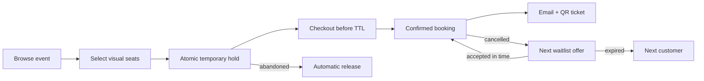
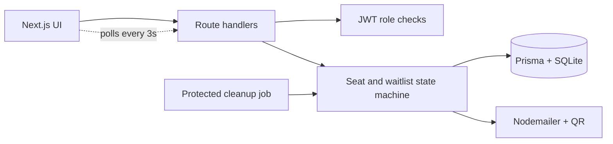

<div align="center">

# CineBook

### Fair, concurrency-safe ticket booking for movies and concerts


[](https://nextjs.org/)
[](https://www.typescriptlang.org/)
[](https://www.prisma.io/)
[](#testing)
[](https://github.com/Mayank2142/ticket-booking/tree/main)

Premium event discovery · visual seat selection · expiring holds · fair waitlist offers · QR email tickets

[Live demo](https://ticket-booking-production-9e71.up.railway.app) · [Preview](#product-preview) · [Features](#features) · [Design](#how-the-hard-parts-work) · [Setup](#local-setup) · [API](#api-reference) · [Deploy](#railway-deployment)

</div>

---

## Product preview

| Discover events | Select seats in real time |
|---|---|
|  |  |

The responsive interface follows one cinematic system from discovery to confirmation: deep-black and emerald surfaces, poster-led event cards, live seat states, a curved screen map, sticky checkout summaries, downloadable QR passes, graceful loading/error/empty states, and mobile-first navigation. The artwork in `public/images` is original project artwork generated for CineBook—no third-party film posters or logos are bundled.

## At a glance

| Evaluation area | Implementation | Evidence |
|---|---|---|
| Seat hold and TTL | Configurable transactional holds plus lazy and scheduled expiry | `src/lib/seats.ts`, cleanup route, integration test 2 |
| Concurrency protection | Conditional state transitions inside database transactions | Integration tests 1, 3 and 6 |
| Waitlist allocation | FIFO category queues, atomic offer claims and single-use tokens | Integration tests 3–6 |
| Time-limited offers | Dedicated offered seat, expiry timestamp, token validation and automatic cascade | Offer API and integration tests 4–5 |
| Real-time seat map | Per-show inventory with three-second polling and four visual states | `ShowSeat`, `SeatMap.tsx` |
| QR and email | Booking-reference QR attachment with durable SMTP retry tracking | `qrcode`, Nodemailer, delivery service |
| Role-based workflows | Customer, organiser and admin pages backed by JWT role checks | Protected pages and API routes |

### Booking lifecycle



## Why this project is different

Most booking demos stop at a seat grid. CineBook combines a polished booking journey with the failure-case handling that matters when demand is high:

- **Atomic seat transitions:** a conditional database update must affect exactly one row before a hold or booking succeeds.
- **Materialised show inventory:** every event owns a `ShowSeat` snapshot, so the same venue can safely host many shows.
- **Dual expiry:** abandoned holds and stale offers are released both lazily during seat-map reads and proactively by a protected cleanup job.
- **Fair cancellation recovery:** a cancelled seat is reserved for the first waiting customer in its category, with a single-use expiring token.
- **Offer bypass prevention:** a seat reserved by the waitlist cannot be held or booked without its matching token.
- **Atomic fulfillment:** booking the offered seat and changing `OFFERED → FULFILLED` happen in one transaction.
- **Resilient email delivery:** booking success never becomes booking failure because SMTP is unavailable; undelivered messages are tracked and retried.
- **Layout safety:** admins may fully create, edit, and delete flexible venue layouts, but layouts are locked once events depend on them.

## Features

| Role | Capabilities |
|---|---|
| Customer | Register/login, search and filter events, open rich event details, view live seats, hold/book seats, receive/download QR tickets, join category waitlists, view ticket history, cancel bookings |
| Organiser | Register/login, create movie or concert listings, choose venue/date/time, set per-category pricing, view aggregate bookings and revenue reports |
| Admin | Create arbitrary seat categories, assign category rows and colours, edit/delete unused venues, create events, inspect protected layouts |

Platform capabilities:

- Configurable hold and waitlist-offer TTLs
- Available / selected / held / booked visual seat states with three-second polling
- Responsive poster discovery, event hero, checkout, confirmation, ticket-wallet, and dashboard screens
- Maximum ten seats per checkout with duplicate selection rejection
- Booking references encoded as attached PNG QR tickets
- Protected cleanup endpoint plus email retry queue
- Validation for users, events, prices, categories, colours, rows, dates, and seat IDs
- Health endpoint for deployment readiness
- Six isolated integration/concurrency tests using a disposable SQLite database

## Technology

| Layer | Choice | Purpose |
|---|---|---|
| Full stack | Next.js 14 App Router + React 18 | Frontend pages and backend route handlers in one application |
| Language | TypeScript 5 | End-to-end type safety |
| Styling | Tailwind CSS | Responsive cinematic design system and visual seat grid |
| Data | Prisma 7 + SQLite | Relational schema, transactions, migrations, local/persistent demo storage |
| Authentication | JWT + bcryptjs | Role-based API and page protection |
| Email | Nodemailer SMTP | Booking and waitlist notifications |
| Tickets | `qrcode` | PNG QR attachment encoding the booking reference |
| Scheduling | Protected HTTP cleanup job | Releases holds/offers and retries email |
| Testing | Node test runner + `tsx` | Dependency-light integration and concurrency coverage |

## Architecture



## How the hard parts work

### Seat hold and booking

```text
AVAILABLE --conditional hold--> HELD --held by same customer + unexpired--> BOOKED
    ^                            |
    |-------- TTL cleanup -------|
```

Each requested seat is updated with a status condition. If another request changed the row first, the affected-row count is zero and the entire transaction fails. Booking repeats the guard with `status = HELD`, the customer ID, and `heldUntil > now`.

### Cancellation and waitlist

```text
WAITING --atomic queue claim--> OFFERED --token booking--> FULFILLED
                                 |
                                 +-- TTL expiry --> EXPIRED --> next WAITING customer
```

Cancellation first changes `CONFIRMED → CANCELLED` conditionally, making repeat requests harmless. The next queue member and freed seat are claimed in the same transaction. Queue positions are unique per event/category, and an offered seat requires its exact token. Expiry conditionally marks the offer expired, releases only the matching customer hold, and cascades to the next person.

### Email and QR delivery

The QR contains only the unique booking reference. SMTP success timestamps are stored on bookings/offers. If SMTP is missing or temporarily fails, the booking still returns success, the UI reports that email is queued, and cleanup retries pending delivery up to five times.

For the concise design discussion required by the assignment, see [SYSTEM_DESIGN.md](SYSTEM_DESIGN.md).

## Project structure

```text
ticket-booking/
├── prisma/
│   ├── migrations/              # Versioned database changes
│   ├── schema.prisma            # Relational data model
│   └── seed.ts                  # Demo users, venue, seats, and event
├── scripts/
│   ├── invoke-cleanup.ts        # Production cron entry point
│   ├── run-tests.mjs            # Disposable test DB + migration runner
│   └── verify-email.ts          # SMTP connection check
├── src/
│   ├── app/
│   │   ├── api/                 # Auth, venues, events, seats, bookings, waitlist, cron
│   │   ├── admin/               # Flexible venue management
│   │   ├── organiser/           # Event creation and revenue dashboard
│   │   └── events/              # Customer event and seat-map experience
│   ├── components/              # Navigation, event cards, seat map, QR ticket, footer
│   └── lib/                     # Auth, DB, validation, seats, presentation, delivery, email, QR
├── public/images/               # Original hero and poster artwork
├── tests/
│   └── booking-lifecycle.test.ts
├── output/playwright/           # Verified README screenshots
├── .env.example
├── railway.json
└── SYSTEM_DESIGN.md
```

## Local setup

Requirements: Node.js 20+ and npm.

```bash
git clone https://github.com/Mayank2142/ticket-booking.git
cd ticket-booking
npm ci
cp .env.example .env
npm run db:deploy
npm run db:seed
npm run dev
```

On Windows PowerShell, replace the copy command with:

```powershell
Copy-Item .env.example .env
```

Open [http://localhost:3000](http://localhost:3000). The homepage, event detail and live seat map are public; authentication is requested only when a customer holds, books, joins a waitlist, or opens their tickets.

### Five-minute demo path

1. Sign in as the demo customer.
2. Open **Summer Concert**, choose seats and continue to checkout.
3. Confirm the booking and download the generated QR pass.
4. Open **My bookings** to see the ticket wallet and cancellation action.
5. Sign in as the organiser to inspect booking totals and revenue.
6. Sign in as the admin to create or edit an unused venue and its category rows.

### Demo accounts

| Role | Email | Password |
|---|---|---|
| Admin | `admin@demo.com` | `password123` |
| Organiser | `organiser@demo.com` | `password123` |
| Customer | `customer@demo.com` | `password123` |

### Environment variables

| Variable | Required | Description |
|---|---:|---|
| `DATABASE_URL` | Yes | SQLite URL; local default is `file:./dev.db` |
| `JWT_SECRET` | Yes | Long random JWT signing secret |
| `SEAT_HOLD_TTL_MINUTES` | Yes | Checkout hold duration; default `10` |
| `WAITLIST_OFFER_TTL_MINUTES` | Yes | Offer duration; default `15` |
| `CRON_SECRET` | Yes | Protects cleanup API calls |
| `APP_URL` | Yes | Public origin used in offer links |
| `SMTP_HOST` | Production | SMTP hostname |
| `SMTP_PORT` | Production | Usually `587` or `465` |
| `SMTP_SECURE` | Production | `true` for implicit TLS/port 465 |
| `SMTP_USER`, `SMTP_PASS` | Production | SMTP credentials |
| `SMTP_FROM` | Production | Verified sender address |

Never commit `.env`. Verify production SMTP before launch:

```bash
npm run email:verify
```

## Commands

```bash
npm run dev            # Development server
npm run build          # Prisma generation + production build
npm run typecheck      # TypeScript validation
npm test               # Six isolated integration/concurrency tests
npm run email:verify   # Verify configured SMTP credentials
npm run cron:cleanup   # Invoke the deployed cleanup endpoint once
npm run db:deploy      # Apply committed migrations
npm run db:seed        # Add demo data
```

## Testing

`npm test` creates a disposable database, applies every migration, runs the suite, and removes the database. Coverage includes:

1. Simultaneous holds and bookings produce exactly one winner.
2. Expired checkout holds return to `AVAILABLE`.
3. Concurrent cancellation produces one state change and one offer.
4. Missing/wrong offer tokens cannot book reserved seats.
5. Successful offer booking atomically fulfills the queue entry.
6. Expired offers cascade and concurrent offers select distinct customers.

## API reference

| Method | Endpoint | Access | Purpose |
|---|---|---|---|
| POST | `/api/auth/register` | Public | Customer/organiser registration |
| POST | `/api/auth/login` | Public | JWT login |
| GET | `/api/auth/me` | Authenticated | Current profile |
| GET / POST | `/api/venues` | Public / Admin | List or create venues |
| GET / PUT / DELETE | `/api/venues/:id` | Public / Admin | Read, replace, or remove unused venue |
| GET / POST | `/api/events` | Public / Organiser | Browse or create events |
| GET | `/api/events/:id` | Public | Event detail and prices |
| GET / POST | `/api/events/:id/seats` | Public / Customer | Live map or atomic seat hold |
| POST | `/api/events/:id/book` | Customer | Confirm held seats and queue QR email |
| GET / POST | `/api/events/:id/waitlist` | Customer | View/join category queue |
| GET | `/api/events/:id/waitlist/offer?token=` | Token | Validate time-limited offer |
| GET | `/api/bookings` | Customer | Booking history |
| DELETE | `/api/bookings/:id` | Customer | Idempotent cancellation and reallocation |
| GET | `/api/organiser/events/:id/summary` | Owner/Admin | Bookings and revenue |
| GET / POST | `/api/cron/release-holds` | Cron secret | Expiry sweep and email retry |
| GET | `/api/health` | Public | Database and SMTP readiness |

Errors use `{ "error": "message" }`; successful responses are JSON objects named for their resource.

## Database model

- `Venue → SeatCategory → Seat` stores the reusable physical layout.
- `Event → CategoryPrice` stores organiser listing and per-category prices.
- `Event → ShowSeat` materialises live per-show status and hold ownership/expiry.
- `Booking → BookingSeat` stores immutable booking reference, amount, and selected seats.
- `WaitlistEntry` stores a unique queue position, status, offer token, expiry, and offered seat.
- Booking/offer email timestamps and attempt counts form a small durable delivery queue.

The complete source of truth is [prisma/schema.prisma](prisma/schema.prisma).

## Railway deployment

> **Live application:** https://ticket-booking-production-9e71.up.railway.app

| Production component | Status |
|---|---|
| Web application | Deployed from public GitHub `main` |
| Database | SQLite on a persistent `/app/data` Railway volume; migrations and seed verified |
| Health check | `/api/health` returns `status: ok` and `database: connected` |
| Hold/offer cleanup | Dedicated `cleanup-cron` service runs every five minutes using `railway.cron.json` |
| SMTP delivery | Requires verified provider credentials before production ticket email can be marked ready |

The deployed SQLite assessment architecture is reproduced as follows:

1. Create a Railway project from the public GitHub `main` branch.
2. Attach a volume at `/app/data` and set `DATABASE_URL=file:/app/data/ticket-booking.db`. Railway mounts volumes only at runtime, so `railway.json` applies migrations in the start command.
3. Add all required variables from `.env.example`; use strong unique values for `JWT_SECRET` and `CRON_SECRET`.
4. Generate a public domain, set `APP_URL` to that exact HTTPS origin, and redeploy.
5. Keep the configured health check at `/api/health`.
6. Create a second Railway service from the same repo, select `railway.cron.json` as its config file, copy `APP_URL` and `CRON_SECRET`, and schedule it for `*/5 * * * *`. It only calls the web API and does not need the SQLite volume.
7. Configure SMTP, run `npm run email:verify` through the production environment, then make a real booking and waitlist cancellation.

Railway currently mounts relative application data under `/app`, does not expose volumes during build/pre-deploy, and supports a minimum cron interval of five minutes. Seat-map reads also enforce expiry, so visible stale holds do not wait for cron. See the official [volume](https://docs.railway.com/volumes), [cron](https://docs.railway.com/cron-jobs), and [health-check](https://docs.railway.com/deployments/healthchecks) documentation.

### Production scaling note

SQLite is intentionally retained for a dependency-light assessment deployment with one application instance and a persistent volume. It provides transactional correctness but serialises writes and is not appropriate for horizontal scaling or sustained high-demand traffic. A production evolution should use PostgreSQL, Prisma’s PostgreSQL datasource, row-level locking/serializable transactions, and a durable job queue for email and expiry work.


---

<div align="center">
Built as a full-stack ticket allocation system, not just a seat-picker demo.
</div>
